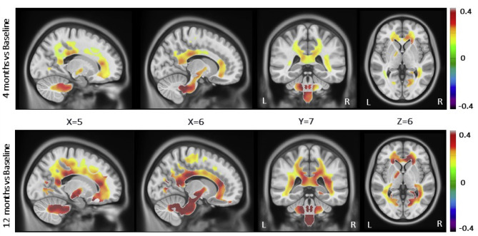
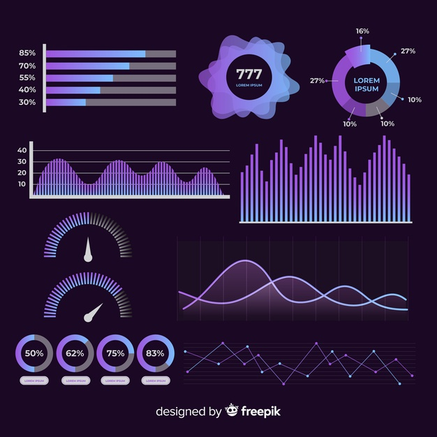
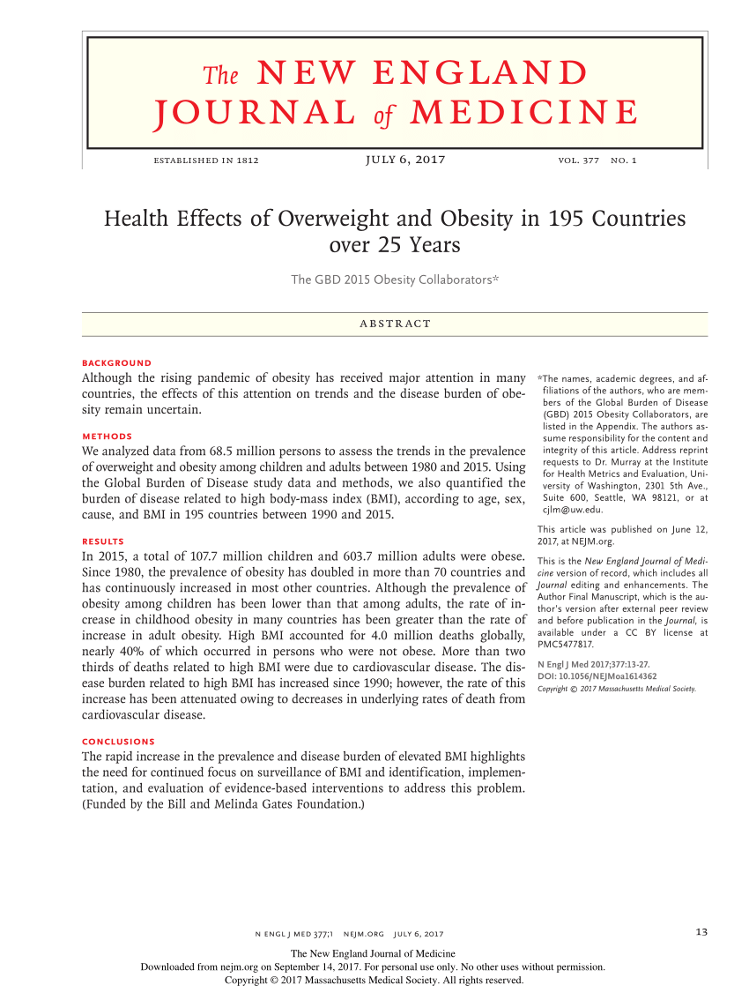

<!-- PROJECT LOGO -->
<br>
<p align="center">
    <h1 align="center"><br>AUTOMATION ADIPOCYTE CELL SIZING</h1>
    <br><br><br></p>


 <h1 align="center">Always keep in mind that the purpose of this file is REPROCDUCTIBILITY! </h1><h2 align="center">It is not about getting the same results with the same data BUT about any researcher being able to get the equivalent results in an equivalent population.<br> </h2>
<br>

### Project particpants
1. Principal Investigator : First name, Last name, Email, GitHub: @github_ID, Slack : slack_id
2. Co-investigator : *idem*
3. Senior Supervisor : *idem*
4. Research associate : *idem*
5. Students implied : *idem*


### Short description of the project

   Insert your short description of the project (max 150 words).When available link the proposal or ethical accepted project.
   
   <p align="center"> Full description of the project is available [below](#about-the-project).

   
### Overall objective

Provide a clear description of the overall objective of the project and the underlying hypothesis.

### Secondary objectives

Provide a clear description of the other objectives of the project and the underlying hypothesis.


<!-- TABLE OF CONTENTS -->
## Table of Contents

* [About the Project](#about)
  * [Background](#Background)
  * [Objectives](#Objectives)
  * [Material and Method](#Method)
  * [Results](#Results)
  * [Conclusion(s)](#Conclusion)
* [Perspectives](#perspective)
* [Getting Started](#getting-started)
  * [Prerequisites](#prerequisites)
  * [Installation](#installation)
* [Research log _ Let's GO !](#log)
* [To Do List](#todo)
* [Current issue](#issue)
* [Upcoming deadlines](#deadlines)
* [References](#References)


<!-- ABOUT THE PROJECT -->
## About The Project <a id="about">

<p align="center">_ Full description of the project go here. When possible, it should include the differents section below _<p align="center">

<p align="center">
    <h4 align="left"><a id="Background"</a>Background :</h4> 
Lorem ipsum dolor sit amet, consectetur adipiscing elit. Etiam dui lacus, sagittis lacinia eros eu, porttitor luctus quam. Curabitur lacus magna, gravida vitae hendrerit eu, egestas et lacus. Mauris luctus tellus eget massa blandit, vitae venenatis ligula sollicitudin. Vestibulum in aliquet lorem. Pellentesque eget mattis arcu. Donec vestibulum odio lectus, in condimentum urna fermentum vitae. Nullam et magna mollis, sodales massa in, fringilla nibh. Mauris id semper nisl, sit amet finibus magna. Praesent nec ex massa. 
    
Aenean sit amet rhoncus diam. Pellentesque consectetur velit id nunc commodo, eget consectetur justo mollis. Sed facilisis, lectus eget imperdiet scelerisque, leo massa fermentum erat, varius elementum nibh risus id mauris. Sed pulvinar urna at lacus lacinia, at fringilla est ultricies. Suspendisse interdum imperdiet efficitur. Nullam dapibus mi libero, quis varius quam feugiat ut. Donec eu elementum ante, et tincidunt quam. Quisque est urna, venenatis vitae leo quis, semper semper elit. Curabitur sit amet vestibulum urna. Interdum et malesuada fames ac ante ipsum primis in faucibus. Sed nec imperdiet lorem. Etiam vehicula, tellus dignissim laoreet consequat, libero lorem eleifend tellus, sit amet venenatis nibh velit nec neque.

<p align="center">
    <h4 align="left" id="Objectives">Objectives :</h4> 
    Donec vitae dapibus orci, vel bibendum nisl. Nam nibh enim, cursus sit amet egestas eget, elementum vel neque. Sed dapibus nisl ac metus ornare vestibulum vitae ac mi. Nullam posuere suscipit ex, non hendrerit enim. Ut eget ipsum nec urna sodales maximus in non purus. Aliquam a diam ut tortor tempor pharetra. Vestibulum ante ipsum primis in faucibus orci luctus et ultrices posuere cubilia curae;

<p align="center">
    <h4 align="left" id="Method">Material and Method :</h4> 

Maecenas vitae metus ex. Proin id quam cursus magna molestie eleifend. Aenean sapien mauris, bibendum quis sem non, cursus tempor mi. Cras tristique nibh eget nibh laoreet facilisis vel ac felis. Integer convallis lacus vitae felis faucibus, sit amet consequat neque luctus. Aliquam erat volutpat. Nullam pretium laoreet turpis id lobortis. Praesent turpis mi, consectetur non justo et, congue faucibus nisl. Maecenas eu eros pharetra, fringilla odio ac, maximus urna. Morbi tellus ex, varius sed pellentesque sed, congue ac leo. Phasellus tempor convallis dolor, in malesuada odio placerat id. Aenean rhoncus lacinia nisi, vitae lacinia eros pharetra quis. Fusce condimentum, justo eu lacinia mollis, diam urna sodales justo, eleifend molestie massa libero nec felis. Pellentesque laoreet, leo sed consectetur euismod, nisi quam consequat magna, vitae auctor diam ligula id enim. Nunc id ante quam.

Nam quis mollis nibh. Fusce mauris elit, posuere et pharetra at, euismod sit amet arcu. Suspendisse sed hendrerit ligula, nec congue augue. Sed hendrerit mattis est at maximus. Nulla faucibus convallis semper. In sed vehicula purus. Nulla vehicula velit sit amet lectus faucibus, vel commodo nisl tempor. Sed id tincidunt metus.

<p align="center">
    <h4 align="left" id="Results">Results :</h4> 
    Mauris nec lectus eu eros venenatis consectetur. Cras porttitor quis eros quis tincidunt. Praesent sit amet congue leo. Aliquam condimentum ultricies diam, vitae vehicula velit rutrum facilisis. Phasellus sollicitudin molestie libero. Sed tempus, augue nec mollis varius, arcu risus aliquam nunc, ac accumsan elit erat porta dui. Proin mollis nunc in tempor viverra.    
         Ut eu urna urna. Nulla bibendum dolor metus, sed dapibus dolor vulputate nec. Cras semper eleifend augue, semper blandit nunc cursus ut. In in ultricies ipsum, eget eleifend tortor. Sed feugiat sapien in odio lobortis, sed viverra ligula tincidunt. Sed ac elit felis. Donec non porta metus. Cras vel blandit mauris. Nullam magna odio, feugiat varius imperdiet eu, tempor quis neque. Interdum et malesuada fames ac ante ipsum primis in faucibus. Sed facilisis, enim sit amet gravida blandit, dolor urna congue lorem, sed aliquam nunc sapien rutrum lacus.

Duis quis vehicula lorem. Proin at eleifend magna. Nullam elit lectus, hendrerit id elementum non, cursus finibus ipsum. Duis in dapibus dolor. Nulla rhoncus nulla ligula, et efficitur elit sodales vel. Fusce pellentesque tincidunt mauris nec tincidunt. Ut sodales a nisi et placerat. Morbi velit elit, vestibulum ac diam id, gravida congue nulla. Pellentesque habitant morbi tristique senectus et netus et malesuada fames ac turpis egestas. Nullam rhoncus, augue et eleifend sagittis, risus ligula tincidunt libero, et consectetur lectus quam eget nibh. Nam ultrices nec nibh a egestas. Praesent metus massa, pharetra eget dignissim eu, maximus eu sapien. Mauris ut imperdiet tellus, at tempus mi. Nunc augue magna, vestibulum sit amet risus eget, pharetra auctor leo.
    
<p align="center">
    <h4 align="left" id="Conclusion">Conclusion(s) :</h4>  </p>
   Phasellus imperdiet dui nisl, eu pharetra sapien tempor et. Phasellus quis auctor dolor, eu rutrum sem. Quisque bibendum mi erat, et laoreet nunc interdum a. Aliquam lectus neque, semper ut maximus nec, bibendum eget felis. Donec tincidunt imperdiet nunc vitae volutpat. Curabitur vel ipsum et erat sollicitudin fermentum vel ac libero. Cras pellentesque faucibus sem, quis elementum libero volutpat et.
  


## Perspectives :<a id="perspective">

ie. Publications / Next projects / Master - PhD / Grant...

  
   <p align="center">
   </p> 


<!-- GETTING STARTED -->
## Getting Started


### Prerequisites

This is an example of how to list things you need to use :


```sh
pip install dcm2bids
```

### Installation
 
the software, version, and how to install it.


<!-- RESEARCH LOG -->
## Research log _ Let's GO ! <a id="log">

Or any other text that can help you to follow your works

<p align="center">
   </p> 


<!-- To do list -->
## To do list <a id="todo">

- [ ] Finish cleaning the database
- [ ] Re-do the regression analysis for the thirty-fifth time
- [ ] Buy Beiko to my favorit post-doc


<!-- ISSUE -->
## Current issue <a id="issue">

Please do prefer [create an issue](https://github.com/icetasy-dot/GutBrain/issues/new) or pull a request.

<!-- NEXT -->
## Upcoming deadlines <a id="deadlines">

* Journal club, the YYYY/MM/DD


<!-- REFERENCES -->
## References

 MUST ALSO INCLUDE REFERENCES FOR SOFT/PACKAGE/GIT...
<br>
<br>

* O'Campo P, Dunn JR, editors. Rethinking social epidemiology: towards a science of change. Dordrecht: Springer; 2012. 348 p.
* Schiraldi GR. Post-traumatic stress disorder sourcebook: a guide to healing, recovery, and growth [Internet]. New York: McGraw-Hill; 2000 [cited 2019 Nov 6]. 446 p. Available from: http://books.mcgraw-hill.com/getbook.php?isbn=0071393722&template=#toc DOI: 10.1036/0737302658
* Halpen-Felsher BL, Morrell HE. Preventing and reducing tobacco use. In: Berlan ED, Bravender T, editors. Adolescent medicine today: a guide to caring for the adolescent patient [Internet]. Singapore: World Scientific Publishing Co.; 2012 [cited 2019 Nov 3]. Chapter 18. Available from: https://doi.org/10.1142/9789814324496_0018
* Stockhausen L, Turale S. An explorative study of Australian nursing scholars and contemporary scholarship. J Nurs Scholarsh [Internet]. 2011 Mar [cited 2019 Feb 19];43(1):89-96. Available from: http://search.proquest.com/docview/858241255?accountid=12528
* Kanneganti P, Harris JD, Brophy RH, Carey JL, Lattermann C, Flanigan DC. The effect of smoking on ligament and cartilage surgery in the knee: a systematic review. Am J Sports Med [Internet]. 2012 Dec [cited 2019 Feb 19];40(12):2872-8. Available from: http://ajs.sagepub.com/content/40/12/2872 DOI: 10.1177/0363546512458223
* Subbarao M. Tough cases in carotid stenting [DVD]. Woodbury (CT): Cine-Med, Inc.; 2003. 1 DVD: sound, colour, 4 3/4 in.


