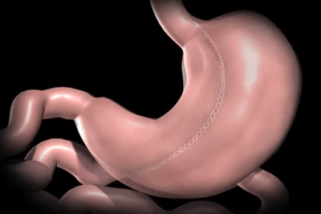
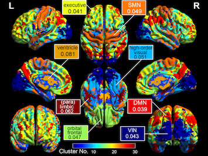
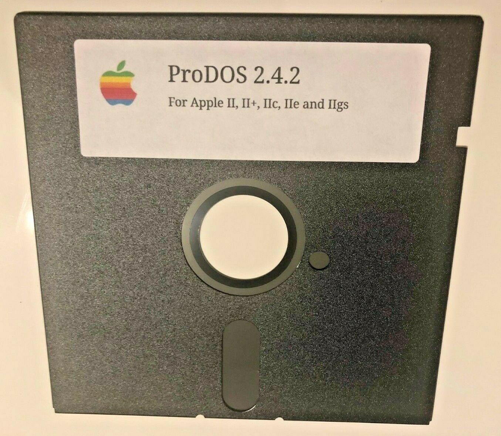
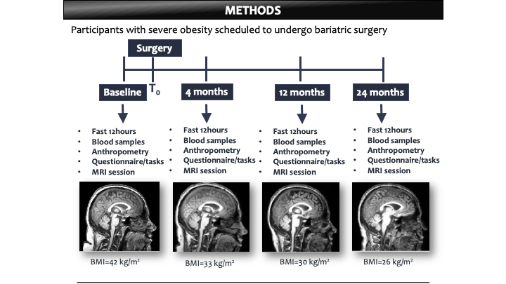
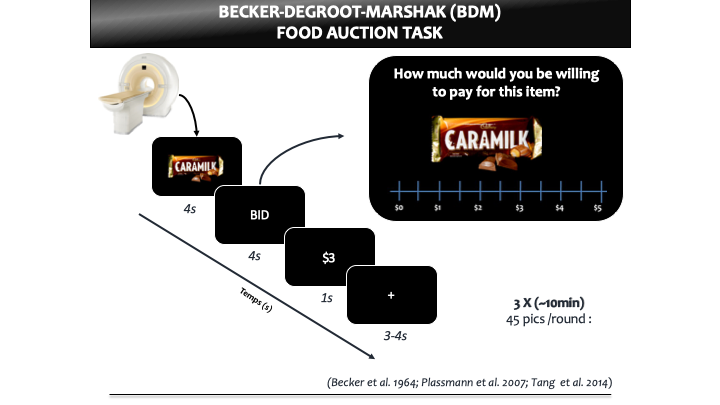
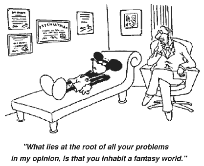

# Functional connectivity and bariatric surgery
Team contributor: Sylvain Iceta (M.D., Ph.D.) under the direction of Pre Andreanne Michaud & Pr André Tchernoff

<p align="center">
 
</p>


## Summary 

Aim : To explore resting state changes after weight loss due to bariatric surgery
Skills to build : BIDS / fMRI Pre Processing / Resting State Analysis


## To be or not be ?

Difficult to know who we really are, right ?

With a question like that you would have guessed I'm either a socratic philosopher or a freaking psy...

So let’s go for a kind of psychiatrist, neuroscientist and a little bit nutritionist...

I got my M.D. in psychiatry in 2013. Since 2013, I worked as a senior psychiatrist at Lyon University Hospital. I took part in the creation (and then in the management...) of a Tertiary Referral Centre for Eating Disorders. I also worked at the Integrative Center for Obesity as referal psychiatrist, especially for the assessment before bariatric surgery. I completed my  doctoral studies in neurosciences in parallel of my clinical hospital activity. I 

During my PhD, I studied the markers of vulnerability to food disinhibition in obesity. My work led me to develop a comprehensive model of food intake control. My thesis work has demonstrated the importance of considering the addiction transfer from a product (i.e. tobacco) to food (manuscript in preparation). Using artificial intelligence and machine-learning , I also proposed an ultra-fast screening test for food addiction (Iceta S et al., Eating and Weight Disorder, 2020, under review). Another part of my PhD work was about the measurement of event-related potential (EEG cognitive function reflect) in obese participants with or without food disinhibition. This study demonstrated a potential neurobiological overlap between addictions and food disinhibition (Iceta S et al. Int J Obes, 2019). I have also shown that ghrelin may play an important role in this food disinhibition (Iceta S et al., 2019, Diabetes Metab).

My PhD studies in neuroscience and my professional experience as a psychiatrist specialized in obesity and eating disorders had me work alongside many patients suffering from severe obesity and binge eating disorder. This led me to better understand why some people are more vulnerable than others to an obesogenic environment and are at higher risk of developing obesity. Since 2015, I am conducting pre- and post-bariatric surgery clinical assessment. This expertise confronts me to the “honeymoon” phenomenon. After bariatric surgery, we clinically observe a major improvement of eating behavior, at least during the first year which correlates with dynamic weight loss. Interestingly, we observe a trend for a behavioral turn back coincident with body weight stabilization or weight regain after this period. I am convinced that solutions to manage and prevent obesity and eating disorders will emerge from better understanding of the mechanisms underlying this “honeymoon” period. For these reasons, I chose to focus my future research on neurobehavioral factors of food intake and appetite control as well as their interaction with endocrine and gut signals, as critical determinants of appetite regulation, disordered eating and excessive weight gain.


After graduating from my PhD in January 2019 I decided to move on a postdoctoral fellow... in nutrition....

 My postdoctoral is focusing in neuroimaging and neuroendocrine aspects of food intake. It started in septembre 2019 and i should stay in Quebec until septembre 2021 (maybe more...). I have chosen to pursue my postdoctoral studies under the supervision of Pr Andreanne Michaud and the co-supervision of Pr Andre Tchernof at the Quebec Heart and Lung Institute—Laval University. The Quebec Heart and Lung Institute represents one of the best places to improve my training in bariatric surgery. Indeed, the bariatric surgery team is one of the most important in the world, with their pioneering work leading to new surgical approaches. They operate more than 650 patients per year and have been able to maintain high follow-up rates for up to 20 years.

In addition, I have had the privilege of getting married and being raised by my twins girls who are now almost 6 years old… To relaxe I love scubadiving, especially scuba diving below 100 feet, I love the peacefulness you can find there.

And to finish introducing myself, I loved the course on the terminal that reminded me my childhood with floppy disks 5.25   
<p align="center"> </p>

Researchgate : https://www.researchgate.net/profile/Sylvain_Iceta

Slack : Sylvain Iceta

Email : sylvain.iceta.1@ulaval.ca


## Project definition 

### Background

Obesity is a neurobehavioral disorder resulting from a vulnerable brain exposed to an obesogenic environment1. Structural and functional brain alterations induced by obesity may explain the link between obesity and cognitive dysfunction2. Whether these changes can be reversed after weight loss is unclear. Bariatric surgery represents the most effective treatment for severe obesity, leading to sustained weight loss and long-term metabolic recovery3. Besides these well-known metabolic recoveries, recent studies have shown improvement in cognitive functions and food preferences4. However, the impact of bariatric surgery on brain structure and function has been scarcely addressed and most studies were performed in Roux-en-Y gastric bypass (RYGB). It is essential to better understand the impact of weight loss and metabolic improvements on brain function, cognitive functions and eating behaviors, especially in long-term.

The overall objective is to better characterize brain function, appetite behaviors and cognitive function prior to as 4, 12 and 24 months after bariatric surgery. We will test the hypothesis that: i) bariatric surgery induces functional and structural changes in brain regions involved in cognitive control and dietary decisions, which improve feeding behaviors and cognitive performance; ii) these changes are associated with improvement in metabolic alterations and inflammation after surgery.

To perform this project, we currently recruit participants with severe obesity scheduled to undergo bariatric surgery (30 participants with Sleeve Gastrectomy (SG), 30 with RYGB, 30 biliopancreatic diversion with duodenal switch and 30 obese controls). 94 participants have been recruited so far. Participants undergo 4 MRI sessions (before as well as 4, 12 and 24 months after surgery). 

The MRI protocol includes: 

1) anatomical T1-weighted scan to measure grey and white matter density using voxel-based morphometry; 

2) resting-state fMRI to measure functional brain connectivity; 

3) fMRI during the Becker-Degroot-Marshak food auction task5. During this task, participants are instructed to bid money on high or low calorie food items. This task assesses the subjective value of food. A general linear model will be applied to model the BOLD responses to high versus low-calorie food cues. 

Fasting blood samples is collected to measure plasma glucose, insulin, lipid profile, lipopolysaccharide binding protein (LPB), interleukin (IL)-6 and C-reactive protein levels. At each visit, participants fill out validated questionnaires to assess eating behaviors and personality traits. Inhibitory control is measured using the Stop Signal Reaction Time Task and Delay Discounting task.

This relevant study combines bariatric, neuroimaging, neurocognitive and metabolic research in a novel approach to understand the effect of weight loss and metabolic changes on brain function, appetite behaviors and cognitive functions. Showing a reversal of neurological dysfunction associated with obesity will have very strong implications for clinical practice.

1) O’Rahilly Diabetes 2008; 2) Zhang Neuroimage 2018; 3) Gloy BMJ 2013; 4) Alosco Am J Surg 2014; 5) Tang Psychol Sci 2014 

<p align="center">
 
</p>


### Special Focus for the Brain Hack School

```diff
-! PreProcessing and Resting State Analysis !-
```

### Tools 

This project will rely on the following:

- GitHub & Jupyter Notebook
- BIDS as a standard to organize the neuroimaging data
- fMRI prep for resting state data OR NyPype

And using my ComputeCanada account ! 

And also data visualization tools (e.g. Numpy, Matplotlib, Seaborn).

### Data 

I'll start first on 10 raw scan and then do it on all my participants!


## Results 


### Tools I learned during this project

- My terminal is now my best friend thanks to the Brain Hack School

- Git and GitHub (also for recovering a deleted branch!)

- Jupyter Notebook (Python, R and Bash Kernel)

- Compute Canada servers and technical support...

- Docker and Singularity

- dcm2niix, Dcm2Bids

- bids-validator

- fMRIprep

### Results 

As I didn't get access to the full data set I focused more on :

- Convert DICOM to BID
<p align="center">
<a href="/GUT BRAIN Project/BIDS_Dataset/DICOM_to_BIDS/Readme.md"></a>
<a id="back1">
<br>
<br>
- BIDS organisation : still pending 
<p align="lefts"></p>

- running fMRI prep on my local conmputer: Done

- running fMRI prep on Compute Canada : almost done !

<p align="center">
<a href="/GUT BRAIN Project/Sub-Project/PreProcessingMRI/fMRI Prep/README.md">
</a>
<a id="back2">
</p>

- Sub-project organisation

<p align="lefts"></p>

- Readme.md template

- Convincing other lab members : a teaser to help ! 
<p align="center">
<a href="https://www.youtube.com/watch?v=5-3lhKt3LsI"></a>
</p>


## Conclusion and acknowledgement

Thanks to the all Brain Hack School team!

<p align="center">


